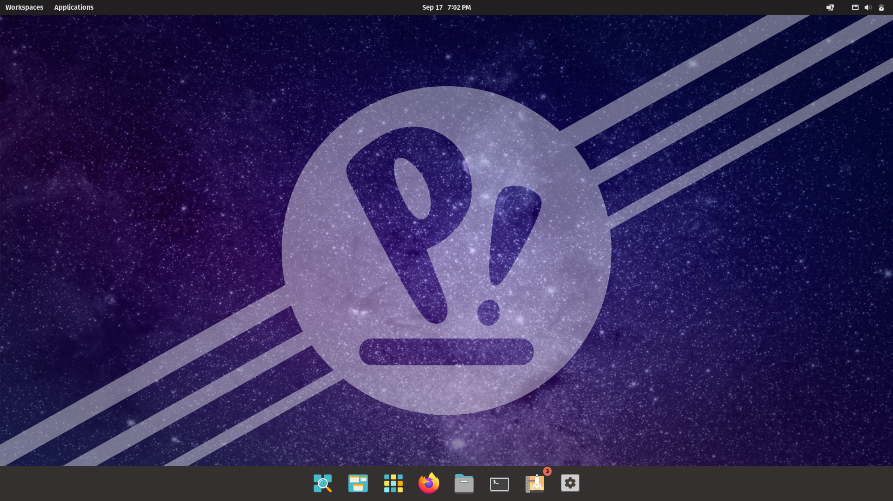
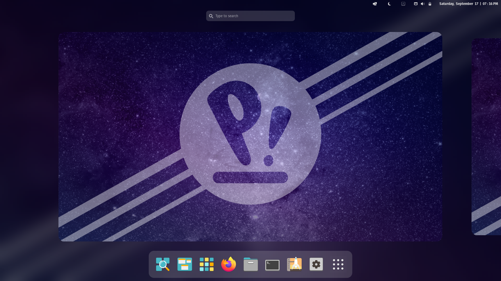

# myPopConfig

This a Quick Script to set up **Pop!_OS**.

## Get Started

Just copy the following command in your Terminal.

```bash
git clone https://github.com/thekarananand/myPopConfig.git
cd myPopConfig
chmod +x install.sh
clear && ./install.sh
```

## Before



## After



## This Script will do Following Actions

- Install `nala` (Frontend for `apt`)
- Update .deb & Flatpak apps.
- Set up Grub Bootloader for Multiboot.
- Replace Libre-Office by Only-Office.
- Add Repositories and Install for
    - Visual Studio Code
    - Grub Customizer.
- Set up Flathub Repo.
- Removes the following pre-installed .deb Packages
    - Gnome-Weather
    - Gnome-Calendar
    - Gnome-Contacts
    - Gnome-Video
    - Gnome-Password & Keys
- Install .deb packages
    - htop
    - neofetch
    - Telegram-desktop
    - Discord
    - Gnome Software
    - Gnome Extensions
    - Extension Manager
    - qBittorrent
    - Inkscape
    - geg
- Install Flatpak packages
    - Calculus
    - Wike
    - Extensions Manager
- Set Up **TLP** for Battery Management.
- Disabling the following Extensions
    - Cosmic Dock
    - Cosmic Workspaces (Vertical Workspaces)
    - Cosmic X11 Gestures.
    - Pop COSMIC
- Installing, Enabling & Configure the following Extensions
    - Blur my Shell
    - Date Menu Formatter
    - Just Perfection
    - Light/Dark Theme Switcher
    - Locks Keys
    - Removable Drive Menu
    - User Themes
    - X11 Gestures